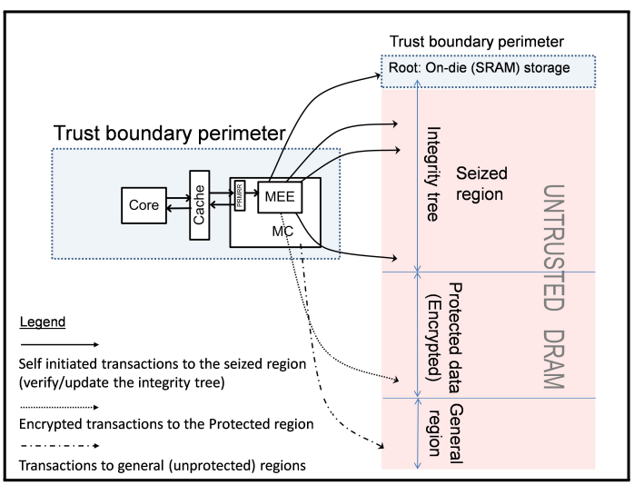
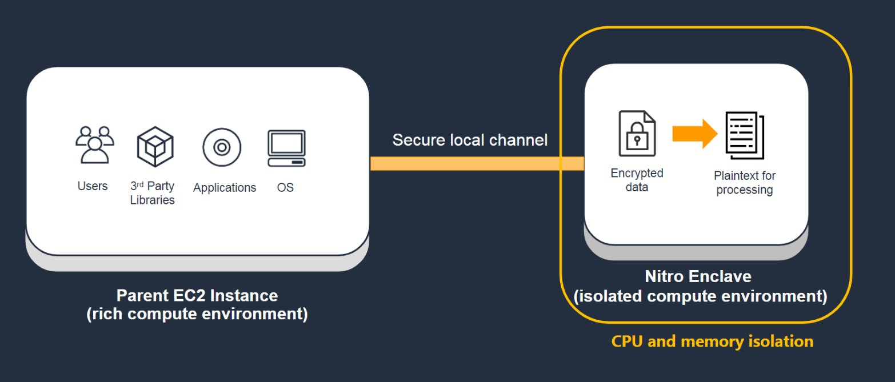
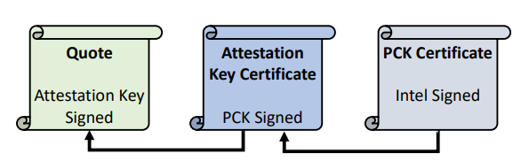
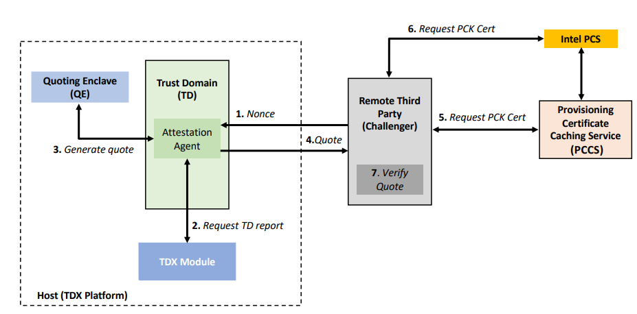
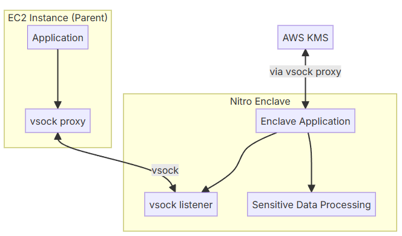

# Trusted Execution Environment: 定义、威胁模型与核心机制

## 1. TEE 的定义

Trusted Execution Environment (TEE) 通常是指一种通过硬件与系统协同设计所建立的受保护执行环境，其目标是在宿主操作系统、hypervisor 乃至其他高权限软件不可被默认信任的前提下，为特定工作负载提供受约束的执行边界，并保护其代码与数据免受未授权访问或篡改。

不过，TEE 在文献与工程语境中的定义并不完全统一。一类表述将 Trusted Execution VM 单独称为 TEE，而将 secure enclave 视为另一类对象，例如 Intel SGX；另一类表述则将 enclave 方案本身直接纳入 TEE 范畴。术语差异的存在，说明 TEE 更适合作为能力集合来理解，而不宜仅按产品命名或外部形态加以区分。

因此，本文采用如下统一口径：凡是通过硬件和系统设计，将某段执行环境从宿主或管理面中切分出来，并使外部实体能够验证其身份、初始状态以及受保护属性的机制集合，均纳入 TEE 的讨论范围。在这一口径下，VM-based TEE 与 enclave-based TEE 并非互斥体系，而是两种常见实现形态。该定义同时构成后文讨论 threat model、security principles 与具体机制的共同前提。

## 2. Threat Model and Security Principles

### Threat Model
TEE 的分析首先建立在特定 threat model 之上。与传统虚拟化不同，TEE 不再默认宿主软件栈整体可信，而是假定 adversary 可能具备较高权限，能够控制 host OS、hypervisor、boot firmware、System Management Mode (SMM) 乃至部分外设路径。在更强的攻击模型下，攻击者不仅可能尝试读取敏感数据，也可能试图篡改执行状态、操纵输入、重构 I/O 路径，甚至伪造 attestation 链路。与此同时，多数 TEE 方案并不保证 availability：若攻击者掌握调度、内存分配或平台资源控制权，仍然能够发起 Denial of Service (DoS) 或中断受保护执行。因而，TEE 的目标并不是提供完备的系统安全，而是在特定对抗模型下收缩可信边界，并保护 confidentiality、integrity 与 verifiability。

### Security Principles
在这一威胁模型下，TEE 的 security principles 可以概括为四类：
1. 机密性，即敏感内存和关键状态不能被宿主直接观察。
2. 完整性，即执行状态不能被底层在无证据的情况下静默篡改。
3. 系统需要限制对 CPU state 与执行上下文的跨域泄露，避免上下文切换或平台管理路径重新获得对受保护状态的控制。4. 系统需要定义明确的 I/O boundary，即哪些数据留在信任边界内部，哪些数据一旦离开边界就需要额外保护。
上述原则共同构成 TEE 的基本安全命题；其中 confidentiality 与 integrity 作用于本地执行边界，而 measurement 与 attestation 则将这一边界扩展为可被远程验证的信任对象。

### Implmentations

#### Hardware-based TEE
Intel TDX 对这一抽象框架给出了较为典型的硬件实现。其 threat model 将 host OS、hypervisor、firmware、peripheral devices 乃至恶意 DMA 均纳入潜在 adversary 范围，并明确指出 availability 不属于其主要保障目标。相应地，TDX 的设计核心在于收缩 Trusted Computing Base (TCB)，将必须被信任的部分压缩到 TDX-enabled processor、相关微架构能力、Intel 签名的软件模块与 attestation 支撑组件之中。也正因为威胁模型被定义得足够严格，TDX 才需要同时提供 memory confidentiality、integrity protection、CPU state isolation 以及 attestation 链路。

#### Cloud-based TEE 
AWS Nitro Enclaves 则在云平台语境下映射到相同的抽象框架。其基本假设并非 parent instance 自动可信，而是通过 Nitro System 将 enclave 从常规实例执行路径中隔离出来，并压缩宿主可见接口，从而降低高权限软件直接接触敏感状态的可能性。Nitro Enclaves 同样不以 availability 为主要保证，而是将重点放在隔离边界、受限资源模型、较小的管理面以及可验证身份之上。由此可见，无论是 TDX 还是 Nitro Enclaves，其设计起点都不是单纯的产品形态差异，而是在共同 threat model 下对 security principles 的不同实现。

综上，threat model 决定了 TEE 需要防御的对象与边界，security principles 则规定了 TEE 必须提供的基本安全性质。前者解释“为什么需要 TEE”，后者解释“TEE 至少应当保证什么”。在这一抽象框架建立之后，后文才有必要进一步讨论隔离机制、运行时状态保护以及远程证明如何分别落地。

## 3. 隔离机制：TEE 的边界基础

隔离机制构成 TEE 的边界基础，因为如果不存在明确的受保护执行边界，后续关于运行时机密性、完整性与可验证性的讨论均失去对象。然而，TEE 中的隔离并不等同于传统意义上的租户隔离。普通隔离主要用于限制不同客体之间的资源访问，而 TEE 所要求的隔离进一步包含对宿主控制面的削弱，即宿主不能再自动获得对受保护执行环境的完全观察权、干预权与重构权。

从抽象层面看，隔离机制至少完成两项任务:
1. 系统需要将受保护执行单元与宿主常规控制路径分离，使敏感执行不再直接暴露于宿主的管理语义之下
2. 系统需要显式缩小 Trusted Computing Base (TCB)，即将必须被信任的部件收敛到尽可能少的处理器、固件、模块和平台服务之中。只有当边界收缩与信任收缩同步成立时，TEE 才能区别于传统虚拟化中的常规隔离。

在 Intel TDX 中，隔离机制的基本对象是 Trust Domain。TDX 保护的是一个受保护的 VM 边界，其核心目标是在宿主平台可能不可信的前提下，为客体系统提供 hardware-assisted isolation。换言之，TDX 并不是在传统 VM 之外附加一个抽象标签，而是试图重构 VM 与宿主之间的控制关系，使 hypervisor 与 host platform 不再对客体执行状态拥有天然的完全支配能力。

According to the TDX threat model, hypervisors and peripheral devices are considered untrusted and are prohibited
from directly accessing the private memory of TDs. It is the responsibility of TDs and their owners to secure I/O data
before it leaves the trust boundary. This requires sealing the I/O data buffers and placing them in shared memory,
which is identified by the shared bit in the Guest Physical Address. Hypervisors or peripheral devices can then move
the data in and out of the shared memory。

在 AWS Nitro Enclaves 中，隔离机制的基本对象则是从 EC2 parent instance 中切分出的更小执行单元。官方文档将其定义为 isolated execution environment，并强调其为 separate, hardened, highly-constrained virtual machine。Nitro Enclaves 不提供持久存储、交互式访问或外部网络，只保留与 parent instance 的本地 socket 通道。这表明，其隔离目标并非尽可能保留完整 VM 语义，而是通过最小化接口面与管理面来压缩攻击面。

因此，TDX 与 Nitro Enclaves 的差异首先体现为边界粒度的差异。前者更接近“在不可信宿主之上提供受保护虚拟机”，后者更接近“从现有实例中剥离一段专门承载敏感逻辑的隔离计算单元”。尽管粒度不同，两者均遵循同一安全原则，即通过隔离机制收缩宿主对敏感执行的控制权。隔离由此定义了 TEE 的外部边界，而边界一旦成立，下一步问题便转向边界内部状态的持续保护。

## 4. 运行时状态保护：内存机密性与完整性

在宿主层不能被默认信任的前提下，地址空间隔离本身不足以保护敏感计算。其根本原因在于，程序的关键状态并不只存在于抽象的地址空间之中，而是分布于寄存器、页表、主存页、缓存行为以及相关 I/O 路径。隔离机制仅规定哪些主体不应访问这些状态，而运行时状态保护进一步回答：即使底层资源被宿主接触，敏感状态为何仍不能被直接读取、重放或无声篡改。

就安全性质而言，本节涉及四个相互关联的概念。第一是 `memory confidentiality`，其目标是阻止宿主、hypervisor 或恶意 DMA 直接读取敏感内存内容。第二是 `integrity protection`，其目标是避免底层在无证据的情况下修改受保护执行状态。第三是 `CPU state protection`，其目标是在上下文切换、缓存状态转移或执行中断过程中，限制处理器内部状态泄露到其他安全域。第四是 `I/O boundary`，其目标是明确哪些数据仍留在信任边界内部，哪些数据一旦进入共享内存、外设路径或外部网络，就必须依赖额外机制保护。上述四者共同决定了 TEE 对运行时状态的保护能力。

- **SGX**：提供 *confidentiality + integrity + freshness*，通过内存加密 + Merkle tree 确保即使内存被篡改或回滚也能被检测（强安全模型）。

- **TDX**：主要提供 *confidentiality*，仅做内存加密（AES-XTS）和少量页级保护，不提供数据级完整性或 replay 防护（弱完整性模型）。

TDX 在这一问题上提供了典型的硬件语义。其文献将 memory confidentiality、integrity protection 与 attestation 并列为核心能力，并明确将 adversary 扩展至 host OS、hypervisor、firmware、peripheral devices 以及恶意 DMA。对应到实现层面，TDX 通过受保护执行模式与内存加密机制，使 Trust Domain 的私有内存不再能够被宿主以传统方式直接读取；同时，TDX 还强调对虚拟 CPU 状态的保护，使上下文切换不会自动泄露 TD 的关键执行信息。对于共享内存与虚拟化 I/O 路径，TDX 则明确不默认提供完全的 confidentiality 与 integrity，说明 I/O boundary 仍然是信任边界中的薄弱处。

Nitro Enclaves 的实现方式与 TDX 不同，但其效果可以落在同一分析框架中。它通过 Nitro System 将 enclave 的 vCPU 与内存自 parent instance 中切分出来，并将外部交互收敛到更少的系统接口。通过 hypervisor 级资源划分，parent instance 的进程、应用以及高权限用户均不能直接访问 enclave 内部状态，这使 Nitro Enclaves 能够在云平台语境下提供运行时机密性。与此同时，Nitro Enclaves 对资源模型作出了明显收缩，不提供外部网络、持久存储与一般交互式访问，从而将 I/O boundary 控制在更小范围内。Nitro 把大量传统 hypervisor/宿主管理功能卸到独立 Nitro Cards 和最小化的 Nitro Hypervisor 上；这个 hypervisor 本身没有通用网络栈、通用文件系统、shell 或交互访问模式，所以宿主高权限软件可利用的“旁路”更少。

综上，运行时状态保护使 TEE 的边界从逻辑隔离扩展为具有物理含义的安全边界。若缺少 `memory confidentiality`、`integrity protection`、`CPU state protection` 与清晰的 `I/O boundary`，TEE 仍可能退化为一类更复杂的隔离容器；只有当宿主难以直接观察、重构或静默篡改运行时状态时，受保护执行才具备实质安全性。不过，这一安全性仍主要停留在本地语境中。对于远程协作场景，还必须进一步回答如何证明当前执行确实对应于预期环境与预期身份。

## 5. 远程证明：从受保护执行到可验证执行

远程证明的核心作用，在于将“本地受保护执行”转化为“外部可验证执行”。如果不存在 attestation，TEE 仍然只是一种局部安全机制：系统或许确实在受保护环境中运行敏感代码，但远端验证者无法判断该执行是否真实发生于合格平台之上，也无法区分其与普通执行环境所暴露的相似接口。

从结构上看，remote attestation 至少包含两层语义。第一层是 `initial measurement`，即对启动时装载的代码、配置以及相关初始状态进行归约，以形成可标识的执行身份。其核心问题是：当前启动出的受保护执行环境究竟是谁。第二层是 `attestation evidence`，即将该 measurement 进一步绑定到平台真实性、硬件或平台属性以及当前会话的可验证证据之上。其核心问题是：这一身份是否确实来自受支持的平台，以及外部为何应当信任本次交互。只有 measurement 与 attestation evidence 被组织为单一信任链，TEE 才从本地安全机制转化为可以参与分布式协作的可信执行对象。

在 TDX 中，远程证明主要体现为对 Trust Domain 真实性的验证。相关文献将其描述为租户验证某一 TD 是否运行在 genuine TDX-enabled Intel processors 上的能力。由此可见，TDX 的 attestation 重点并不在于某种孤立报文格式，而在于它改变了租户建立信任的方式：在传统云环境中，租户通常只能依赖服务提供商的声明；而在 TDX 模型下，租户开始获得由处理器、平台组件与证书链共同支撑的 attestation evidence，从而验证特定 measurement 与平台属性是否成立。

在 Nitro Enclaves 中，远程证明则更直接围绕 enclave identity 展开。AWS 文档强调 Nitro Enclaves supports an attestation feature，能够验证 enclave identity，并确保 only authorized code is running inside it。这说明 Nitro 的证明链路并非孤立的证书颁发过程，而是 enclave 身份、授权代码与平台安全属性的结合点。进一步结合 Nitro System 的安全设计可以看到，其 attestation 之所以具有意义，是因为证据建立在 Nitro Hypervisor、Nitro Cards 以及被压缩后的平台管理面之上，而非建立在 parent instance 的普通控制路径之上。

Nitro Hypervisor 生成Attestation Document(AWS 没有公开披露该私钥在底层究竟保存在 Nitro 卡、Hypervisor 专用受保护存储，还是其他 AWS 内部密钥基础设施中) ->  Intermediate CA(s) --> AWS Nitro Root

> Nitro Enclaves 的 attestation document 是平台侧签的，不是 enclave 内部 KMS key 签的；enclave 内部 key 只是在 attestation 之后被用来承接上层协议或密钥释放。

因此，远程证明所补足的并不是附加的一张证书，而是可信执行体系中的最后一段信任缺口。隔离机制定义了边界，运行时状态保护保证边界内部状态不易泄露或篡改，而 `initial measurement` 与 `attestation evidence` 则使该边界的身份、初始状态与平台真实性能够被外部验证。至此，TEE 的基本闭环才得以完成。在这一闭环明确之后，TDX 与 Nitro Enclaves 的差异才能被视为不同实现路径，而非概念层面的分裂。

## Common Attacks

The attack surface of a TEE is best understood not as a collection of vendor-specific bugs, but as a sequence of failures in the underlying security assumptions. In that sense, common TEE attacks can be classified by which protection boundary stops holding: isolation, run-time state protection, freshness, trusted I/O, or attestation. Following the adversary framing in *SoK: Hardware-supported Trusted Execution Environments*, this section therefore groups attacks by broken assumptions rather than by implementation family, and discusses their impact along five dimensions: `confidentiality`, `integrity`, `freshness`, `attestation trust`, and `availability`.

At a high level, the relevant attacker classes can be grouped into software control-plane adversaries, physical attackers, microarchitectural or shared-resource attackers, I/O and shared-memory boundary attackers, attestation and key-chain attackers, and persistent-state attackers. This taxonomy is useful because the same TEE may resist one adversary class while remaining exposed to another. In particular, *TEE.fail* shows that modern server-class TEEs cannot be evaluated solely in terms of software isolation; once physical observability, deterministic memory encryption, and weaker integrity/freshness guarantees are combined, the resulting attack surface can extend from memory disclosure to attestation root compromise.

### 1. Microarchitectural and side-channel attacks

This class of attacks breaks the assumption that confidentiality follows automatically from memory isolation. Even when private memory is cryptographically protected against direct host access, shared microarchitectural resources may still leak sensitive execution behavior. Typical examples include cache-based attacks, controlled-channel attacks, single-stepping, branch-prediction leakage, and transient-execution-based disclosure.

- **Broken assumption**: encrypted or isolated memory implies that secret-dependent execution cannot be externally observed.
- **Typical attack surface**: shared caches, page-fault patterns, branch predictors, speculative execution state, interrupt timing, and fine-grained host scheduling control.
- **Primary impact**: confidentiality failure, usually through recovery of secret-dependent access patterns or cryptographic key material.
- **Most affected TEE designs**: enclave-based TEEs are often the most exposed because sensitive code paths are compact and easier to synchronize with the attacker; however, shared-hardware VM-based TEEs remain relevant targets whenever the adversary can observe or steer execution through shared resources.

### 2. Physical memory and bus-observation attacks

This class breaks the assumption that the physical memory path is not observable or manipulable by the adversary. *TEE.fail* makes this case especially explicit for server-based TEEs by showing that DDR5 memory-bus interposition can turn encrypted memory into a source of observable and correlatable execution signals. The key point is not merely that memory can be observed, but that modern server TEEs often rely on deterministic memory encryption and weaker integrity/freshness guarantees than earlier strong-integrity designs.

- **Broken assumption**: the attacker cannot observe or interfere with the physical memory bus at sufficiently fine granularity.
- **Typical attack surface**: DIMM bus interposition, DRAM transactions, ciphertext correlation, physical address mapping, and memory-controller-visible access patterns.
- **Primary impact**: confidentiality loss through ciphertext correlation and memory observation, followed by possible secret extraction and follow-on attacks against attestation roots.
- **Most affected TEE designs**: especially server-based enclave and VM-based TEEs, including designs that protect large off-chip memory but do not provide strong integrity-tree-style freshness guarantees.

### 3. Memory integrity, rollback, and replay attacks

This class breaks the assumption that protecting confidentiality is sufficient to preserve correct execution over time. A TEE may hide data from the host while still failing to detect replayed memory, rolled-back persistent state, or state forking across executions. The distinction is especially important when comparing designs with strong integrity and freshness guarantees to designs that mainly provide confidentiality.

- **Broken assumption**: once memory is encrypted, the attacker cannot meaningfully revert, replay, or fork state.
- **Typical attack surface**: off-chip memory without freshness protection, sealed state restoration, persistent metadata, snapshot/restore workflows, and replayable storage layers.
- **Primary impact**: integrity and freshness failure, including rollback of sealed state, replay of old computation state, and protocol-level inconsistency across sessions.
- **Most affected TEE designs**: TEEs that do not maintain strong freshness metadata or integrity trees over protected state; this risk is especially important for server TEEs and systems with persistent secrets or long-lived protocol state.

### 4. I/O, shared-memory, and Iago-style attacks

This class breaks the assumption that the untrusted system components used for I/O merely transport data and do not shape computation semantics. In practice, many TEEs still rely on untrusted operating systems, hypervisors, parent instances, shared memory, virtio, vsock, or syscall mediation. Once those components are allowed to define return values, reorder events, or manipulate buffers outside the trusted boundary, they can influence enclave or TD behavior without directly reading private memory.

- **Broken assumption**: untrusted system services correctly preserve the semantics of system calls, I/O buffers, and boundary-crossing data.
- **Typical attack surface**: syscall return values, shared-memory buffers, virtio descriptors, vsock-mediated traffic, device emulation, and hypervisor-controlled I/O completion paths.
- **Primary impact**: integrity failure through semantic manipulation of computation, protocol confusion, malformed inputs, or Iago-style privilege and state corruption.
- **Most affected TEE designs**: broadly applicable, but especially severe for TEEs with a narrow protected core that still depend heavily on untrusted system software for storage, networking, and device access.

### 5. Attestation, key-chain, and identity-forgery attacks

This class breaks the assumption that a valid attestation necessarily implies authentic protected execution. Once the trust root behind attestation is compromised, the attacker no longer needs to extract every application secret individually; instead, the attacker can counterfeit the platform identity itself. *TEE.fail* highlights this shift in the server setting by showing that attacks can escalate from memory observation to compromise of the attestation root chain, allowing forged quotes and counterfeit trusted identities.

TEE.fail 并不是“直接读取 PCK”，而是通过 memory interposition + deterministic encryption，把 PCE enclave 变成一个可观测、可操控的 side-channel oracle，从而在其使用 PCK 时将其提取出来

- **Broken assumption**: the attestation root, key hierarchy, and certificate chain remain confined to the trusted platform and cannot be forged or subverted.
- **Typical attack surface**: quoting or provisioning components, attestation key hierarchies, collateral verification, quote generation services, and higher-level deployment flows that accept quotes as the sole proof of trusted execution.
- **Primary impact**: collapse of remote trust, forged platform identity, counterfeit quotes or attestation documents, and “run outside but attest inside” style impersonation.
- **Most affected TEE designs**: affects both enclave-based and VM-based TEEs, but is particularly damaging for server and cloud deployments whose higher-level trust model is built around quote or attestation verification.

### 6. Application-level secret extraction and protocol misuse

This class breaks the assumption that placing an application inside a TEE is itself sufficient to protect long-term secrets. Even when the platform model is sound, applications may still leak secrets through non-constant-time implementations, weak protocol composition, shared master keys, or over-trusting the TEE abstraction. In such cases, the TEE protects the execution container, but not necessarily the correctness of the application’s own security design.

- **Broken assumption**: once code runs inside a TEE, its application-level secrets are automatically protected.
- **Typical attack surface**: cryptographic libraries, secret-dependent control flow, protocol orchestration, key reuse, state export, and application-specific secret handling.
- **Primary impact**: direct application confidentiality failure, long-term key compromise, and downstream impersonation or session decryption.
- **Most affected TEE designs**: all TEE families can be affected, but enclave-based deployments often expose this risk more clearly because they frequently place concentrated, high-value cryptographic logic inside a small trusted component.

Taken together, these attack classes show that TEE security is not a binary property but a layered set of assumptions. Failures of `Isolation` most naturally lead to control-plane and Iago-style attacks; failures of `Runtime Protection` lead to side channels, physical bus observation, replay, and rollback; failures of `Attestation` lead to identity forgery and collapse of remote trust. The practical lesson is that a TEE should be evaluated not only by whether it encrypts memory or issues quotes, but by which attacker classes it excludes, which assumptions it still depends on, and how failures propagate from local execution to system-wide trust.

## References

- [Intel TDX Demystified: A Top-Down Approach](https://arxiv.org/pdf/2303.15540)
- [An Analysis of AWS Nitro Enclaves for Database Workloads](https://dl.acm.org/doi/10.1145/3736227.3736234)
- [The Security Design of the AWS NitroSystem](https://docs.aws.amazon.com/pdfs/whitepapers/latest/security-design-of-aws-nitro-system/security-design-of-aws-nitro-system.pdf)
- [A Memory Encryption Engine Suitable for General Purpose Processors](https://eprint.iacr.org/2016/204.pdf)
- [TEE.fail: Breaking Trusted Execution Environments via DDR5 Memory Bus Interposition](https://tee.fail/files/paper.pdf)
- [SoK: Hardware-supported Trusted Execution Environments](https://arxiv.org/pdf/2205.12742)
- [Flashbot TEE Wiki](https://collective.flashbots.net/t/tee-wiki/2019/1)
- [ATA TEE prover](https://docs.ata.network/tee-overview/tee-prover)
- [Demystify SGX](https://medium.com/obscuro-labs/demystifying-sgx-part-4-secure-hardware-59cd09687d53)
- [SGX 101](https://sgx101.gitbook.io/sgx101)
